# YourWatchRental

YourWatchRental is a full-stack web application built around a watch rental service.

I made it as a portfolio project to bring together the technologies I had been working with and to build something closer to a real application rather than a collection of separate exercises.

The application has two main sides. Customers can browse watches, check their availability and create rentals. Administrators have access to the management part of the application, where they can manage watches, users, branches and rentals.

> **Note:** *This is a demonstration project. YourWatchRental is not a real watch rental service and the payment process is only simulated.*

## Demo

**Live application:** [YourWatchRental](https://yourwatchrental.pl)

**Source code:** [GitHub](https://github.com/jakwgr/yourwatchrental)

---

## What can you do in the application?

A user can create an account and log in, browse the available watches and use filters or sorting to find a particular model.

Each watch has its own details page with photos, basic information and an availability calendar. When the selected dates are available, the user can go through the rental process and manage the rental later from their account.

The application also includes password reset and email notifications. Emails are sent after registration, when a password is reset and when a new rental is created.

### User features

* Create an account and log in
* Authenticate using JWT
* Reset a forgotten password
* Browse the watch catalogue
* Search, filter and sort watches
* View watch details and photos
* Check availability on a calendar
* Create and manage rentals
* View personal rental history
* Manage the user profile
* Go through a simulated payment process

### Admin features

The admin section is separate from the regular user experience.

Administrators can:

* Add, edit and remove watches
* Change watch status
* Add and remove watch photos
* Manage registered users
* Create and manage branches
* View and manage rentals
* Manage watch availability

---

## Emails

Email is handled directly by the backend using SMTP.

The application sends messages for a few different events:

* Registration
* Password reset
* New rental

Creating a rental also triggers an additional email to a dedicated application mailbox. This is used to simulate the kind of notification that could be sent to a branch handling the rental.

No external email management platform is used. The application connects to an SMTP server configured through environment variables.

---

## Payments

There is a payment step in the rental flow, but it is only there to simulate what the process could look like.

No payment provider is connected and no real money is transferred.

This means the project can be used and tested without entering real payment details.

---

## Tech stack

The backend is written in Java and uses Spring Boot. Most of the application logic, authentication and database access lives there.

The frontend is a separate Angular application that communicates with the backend through a REST API.

### Backend

* Java 25
* Spring Boot 4.1.0
* Spring Security
* JWT
* Spring Data JPA
* Hibernate
* PostgreSQL
* Spring Validation
* Spring Mail
* MapStruct 1.6.3
* Lombok
* Maven

### Frontend

* Angular 22.1.1
* Angular CLI 22.1.3
* TypeScript 6.0.3
* Node.js 24.19.0
* HTML
* CSS

### Production setup

The application is running on a Linux VPS.

* Ubuntu
* Nginx
* PostgreSQL
* Java
* HTTPS

---

## How it is put together

The frontend does not access the database directly. Requests from Angular go through the REST API exposed by Spring Boot.

Spring Security takes care of authentication and authorization. The backend handles the application logic, communicates with PostgreSQL through JPA/Hibernate and uses the mail service when an email needs to be sent.

```text
Angular
   │
   │ HTTP / REST API
   ▼
Spring Boot
   │
   ├── Security / JWT
   ├── Controllers
   ├── Services
   ├── JPA / Hibernate
   └── Email Service
          │
          ▼
        SMTP

Spring Boot
   │
   ▼
PostgreSQL
```

This also keeps the frontend and database separated. A user can only access data through the endpoints exposed by the backend and the authorization rules applied there.

---

## Database

PostgreSQL is used as the main database.

The project is built around a few main entities:

* Users
* Watches
* Watch Photos
* Rentals
* Branches

The relationships between these entities are handled through JPA/Hibernate.

Watch availability is also connected to the rental data, so the application can check existing rental periods before allowing a new rental to be created.

---

## Authentication and security

Authentication is based on JWT.

After logging in, the user receives a token which is then used when accessing protected endpoints. Access to particular operations also depends on the user's role.

The backend validates incoming requests and protects endpoints that should not be publicly accessible.

JWT authentication tokens expire after **4 days**.

Password reset uses a separate secret and reset tokens expire after **15 minutes**.

Sensitive configuration is not stored in the repository. Database credentials, JWT secrets and mail credentials are supplied through environment variables instead.

The main security-related parts of the project are:

* Spring Security
* JWT authentication
* Role-based authorization
* Protected REST endpoints
* Request validation
* Environment-based configuration for secrets

---

## Testing

Testing was done mainly on the backend.

There are **103 automated tests** covering controllers, services and important parts of the application's business logic.

The current test run:

```text
Tests run: 103
Failures: 0
Errors: 0
Skipped: 0
```

All **103 backend tests pass**.

There are currently no automated tests for the Angular frontend.

---

## Project structure

The repository contains both parts of the application:

```text
yourwatchrental/
├── backend/
├── frontend/
├── screenshots/
└── README.md
```

The backend and frontend can therefore be cloned and run from the same repository.

---

## Screenshots

### Home page

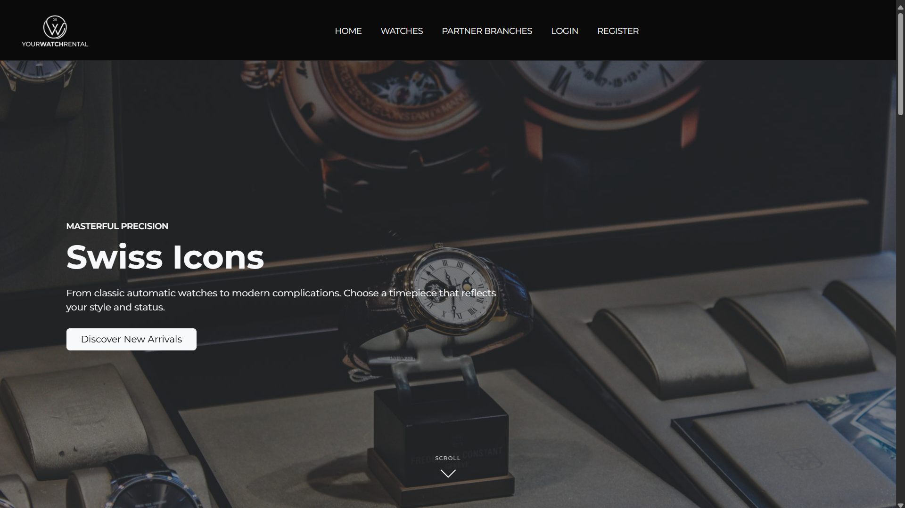

### Watch catalogue

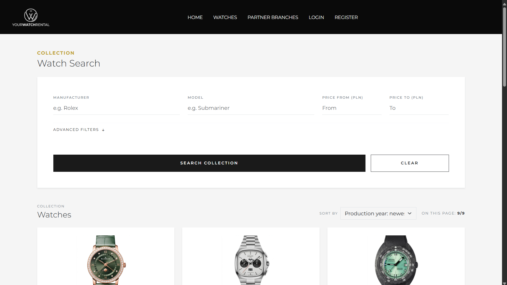

### Watch details

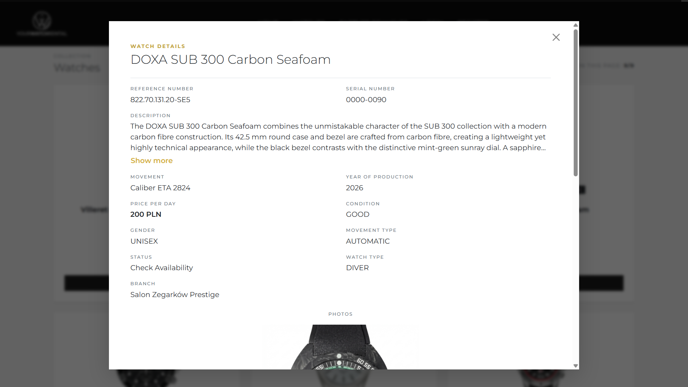

### Availability calendar

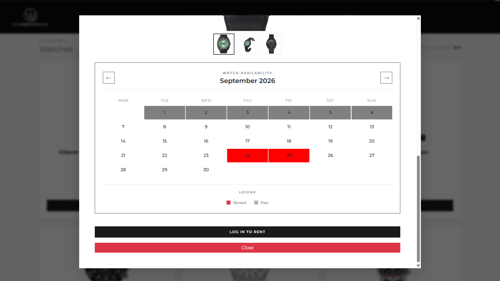

### Rental process

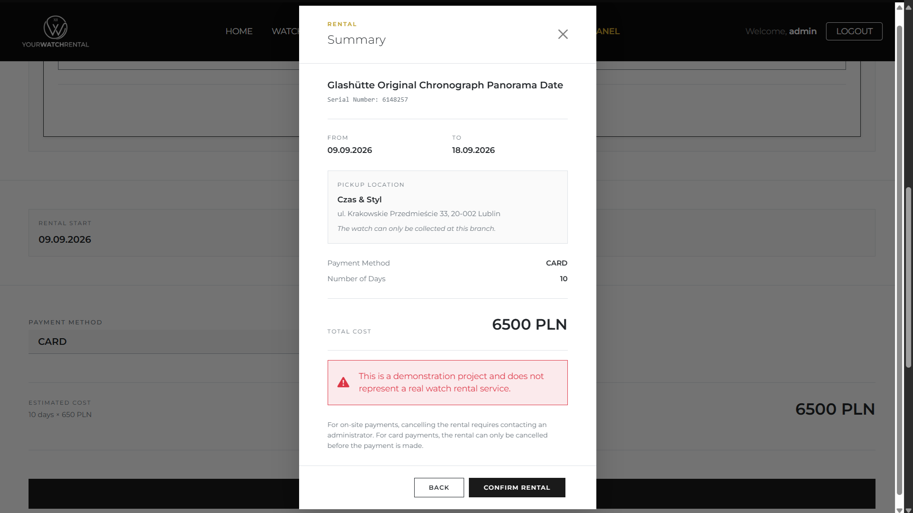

### User rentals

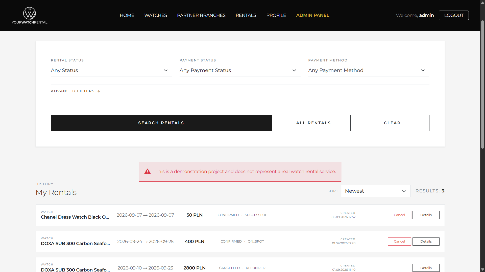

### Admin panel

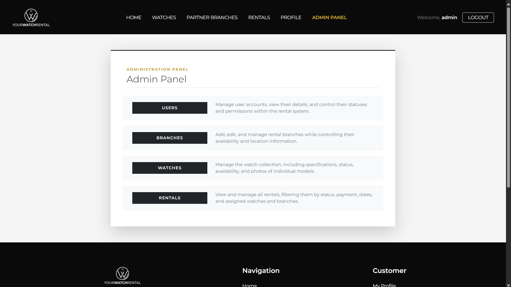

---

## Running the project locally

### What you need

Before starting the application, make sure you have:

* JDK 25
* Node.js 24
* npm
* PostgreSQL
* Git

### 1. Clone the repository

```bash
git clone https://github.com/jakwgr/yourwatchrental.git
cd yourwatchrental
```

### 2. Create the database

Create a PostgreSQL database called:

```text
yourwatchrental
```

The application uses the following connection:

```text
jdbc:postgresql://localhost:5432/yourwatchrental
```

### 3. Configure the backend

The backend uses environment variables for values that should not be stored in Git.

```text
DB_USERNAME=[YOUR_DATABASE_USERNAME]

DB_PASSWORD=[YOUR_DATABASE_PASSWORD]

JWT_SECRET=[YOUR_JWT_SECRET]

JWT_SECRET_PASSWORD=[YOUR_PASSWORD_RESET_SECRET]

MAIL_USERNAME=[YOUR_EMAIL]

MAIL_PASSWORD=[YOUR_EMAIL_PASSWORD]
```

`JWT_SECRET` is used for JWT authentication, while `JWT_SECRET_PASSWORD` is used for password reset.

Use your own PostgreSQL database and SMTP account when running the project locally.

Do not put real credentials directly into the source code or commit them to the repository.

### 4. Start the backend

On Linux or macOS:

```bash
cd backend
./mvnw spring-boot:run
```

On Windows:

```powershell
cd backend
.\mvnw.cmd spring-boot:run
```

The API will start on:

```text
http://localhost:8080
```

### 5. Start the frontend

Open another terminal:

```bash
cd frontend
npm install
ng serve
```

Then open:

```text
http://localhost:4200
```

---

## Environment variables

| Variable              | Used for              |
| --------------------- | --------------------- |
| `DB_USERNAME`         | PostgreSQL username   |
| `DB_PASSWORD`         | PostgreSQL password   |
| `JWT_SECRET`          | JWT signing secret    |
| `JWT_SECRET_PASSWORD` | Password reset secret |
| `MAIL_USERNAME`       | SMTP username         |
| `MAIL_PASSWORD`       | SMTP password         |

JWT authentication tokens expire after **4 days**.

Password reset tokens expire after **15 minutes**.

---

## Application configuration

The relevant configuration looks like this:

```properties
spring.application.name=watchrental

spring.datasource.url=jdbc:postgresql://localhost:5432/yourwatchrental
spring.datasource.username=${DB_USERNAME}
spring.datasource.password=${DB_PASSWORD}

app.password-reset.secret=${JWT_SECRET_PASSWORD}
app.password-reset.expiration-minutes=15

spring.jpa.hibernate.ddl-auto=update
spring.jpa.show-sql=false
spring.jpa.properties.hibernate.format_sql=false

app.frontend-url=https://yourwatchrental.pl

jwt.secret=${JWT_SECRET}
jwt.expiration=345600000
# 4 days

spring.mail.host=smtp.mail.ovh.net
spring.mail.port=465
spring.mail.username=${MAIL_USERNAME}
spring.mail.password=${MAIL_PASSWORD}

spring.mail.properties.mail.smtp.auth=true
spring.mail.properties.mail.smtp.ssl.enable=true
```

The actual credentials are kept outside the repository.

---

## Screenshots

The `screenshots` directory contains images from the application.

Some of the screens that are useful to see:

### Home page


### Watch catalogue


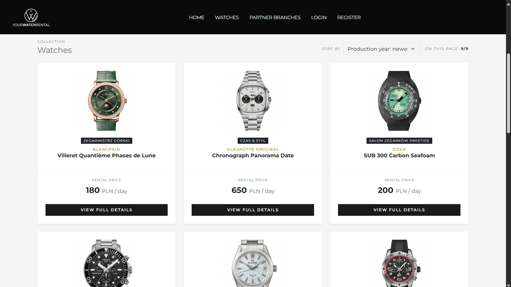

### Watch details


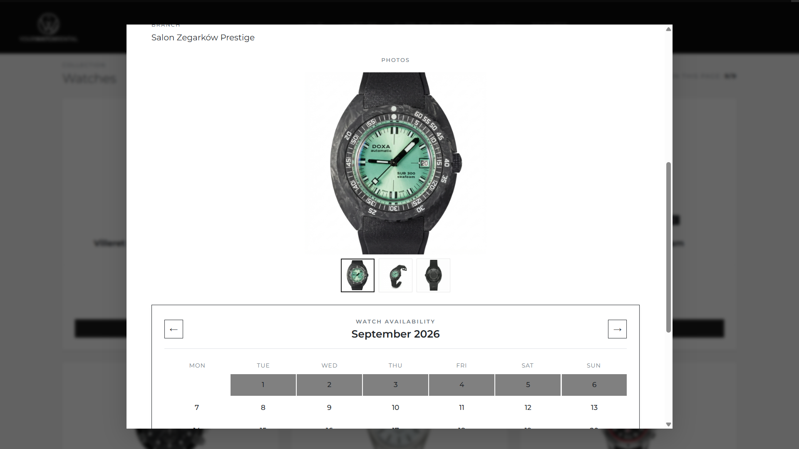

### Availability


### Rental


### User profile

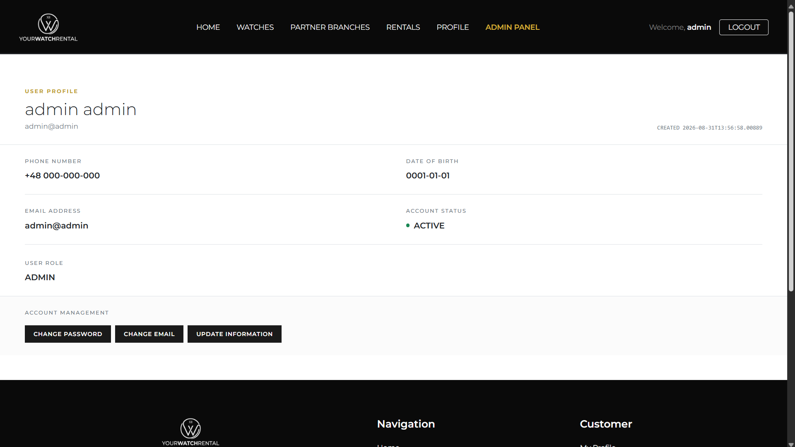

### User rentals


### Admin panel


### Branch management

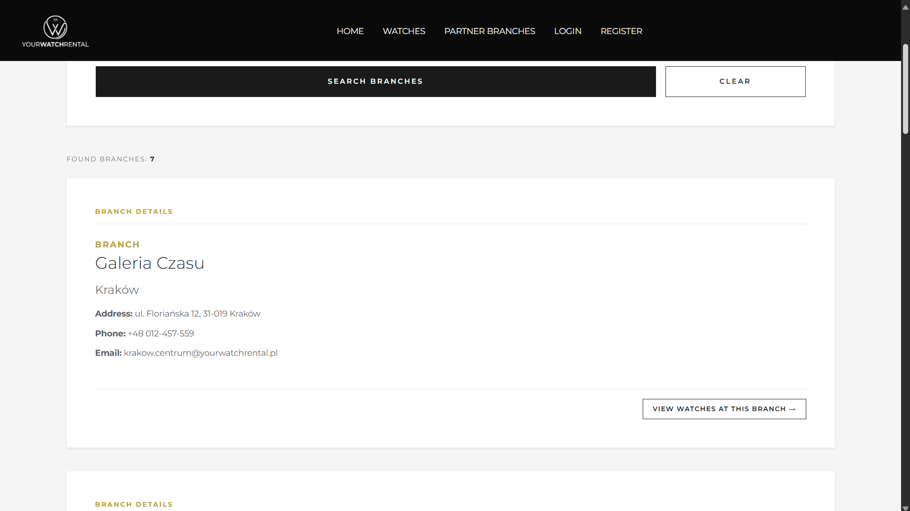

---

## Deployment

The production version is hosted on a Linux VPS.

Nginx is used as the web server and handles HTTPS and incoming web traffic. The Spring Boot application runs separately and communicates with the PostgreSQL database.

The production setup consists of: 

```text
Internet
   │
   ▼
Nginx / HTTPS
   │
   ▼
Spring Boot
   │
   ├── PostgreSQL
   └── SMTP
```

**Live application:** [YourWatchRental](https://yourwatchrental.pl)

---

## Author

**Jakub Waligóra**

GitHub: [jakwgr](https://github.com/jakwgr)

LinkedIn: [Jakub Waligóra](https://www.linkedin.com/in/jakub-walig%C3%B3ra-220809434/)

Portfolio: [YourWatchRental](https://yourwatchrental.pl)

Email: [jwaligora006@gmail.com](mailto:jwaligora006@gmail.com)

---

## Disclaimer

YourWatchRental was created for educational and portfolio purposes.

It is not a real rental business. The payment functionality is simulated and the application does not process real transactions.

## License

No open-source license is provided for this repository.
